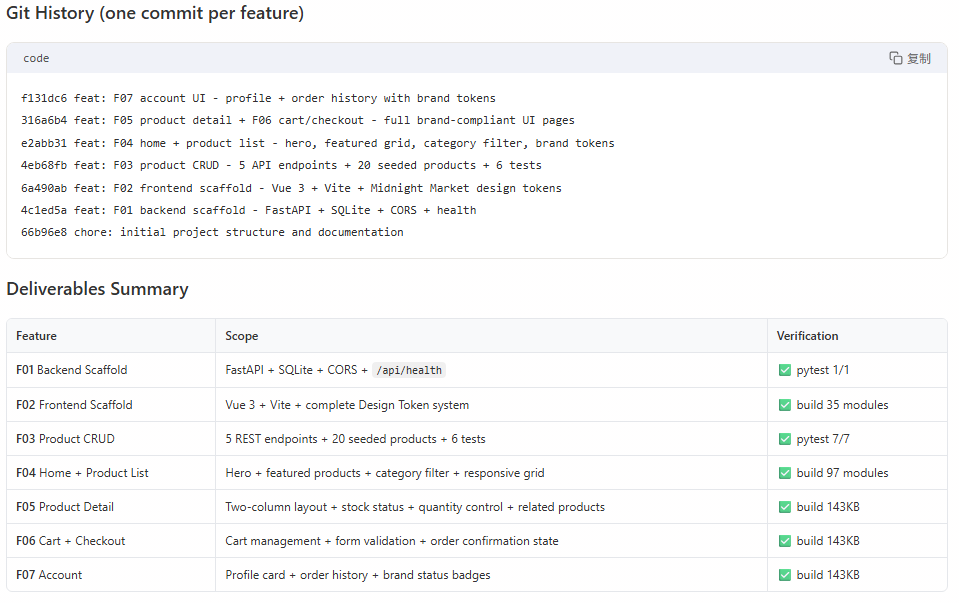

# emberforge

[中文说明](README.zh-CN.md) | English

Build software with AI agents using a workflow that is recoverable, auditable, and dependency-aware.

If this project helps your team ship with less rework and fewer broken handoffs, please consider starring it.

## Why emberforge

Most agent sessions fail on longer delivery because state drifts, verification is skipped, and failures are hard to resume.

emberforge enforces one explicit contract for planning, coding, verification, recovery, and reporting.

## Before vs After

| Without structured workflow | With emberforge |
|---|---|
| Progress lives in chat memory | Progress is appended to `progress.jsonl` |
| Verification is often ad-hoc | Verification order is explicit and repeatable |
| Failures are hard to resume | `verification_fix` recovery is first-class |
| Feature order is easy to break | Dependency-ready scheduling is built in |
| Status reviews are manual | `emberforge-report.html` is regenerated automatically |

## 60-Second Quick Start

1. Prepare the required project files.
2. Load this skill in your coding agent.
3. Ask: Help me build an xxx project.

Required project shape:

- `{PROJECT_DIR}/development-plan.md`
- `{PROJECT_DIR}/docs/README.md`
- `{PROJECT_DIR}/docs/architecture.md`
- `{PROJECT_DIR}/agent/features.json`

See a concrete sample in [sample-project/](sample-project).

Expected runtime artifacts after a healthy run:

- `agent/run-state.json`
- `agent/feature-memory/Fxx.json`
- `agent/session-handoffs/`
- `progress.jsonl`
- `emberforge-report.html`

Walkthrough: [demo.md](demo.md)

## Supported Agents

emberforge works with any AI coding agent that supports custom skills or system prompts.

| Agent | How to use |
|---|---|
| Claude Code | Place skill in your project, then: Help me build xxx |
| Codex | Load as a skill, then: Help me build xxx |
| OpenCode | Load as a skill, then: Help me build xxx |
| Qclaw | Load as a skill, then: Help me build xxx |
| OpenClaw | Load as a skill, then: Help me build xxx |
| Cursor / Windsurf / Copilot | Add to .instructions.md or equivalent, then: Help me build xxx |

## What This Skill Does

- reads `agent/features.json` as the execution backlog
- generates missing feature plans and task boards
- implements one dependency-ready feature at a time
- runs the real verification sequence
- persists failure context for `verification_fix` retries
- appends progress events to `progress.jsonl`
- regenerates `emberforge-report.html`

This is not a generic coding prompt. It is a skill with a concrete runtime contract.

## What Makes This Different

| Topic | Typical prompt workflow | emberforge |
|---|---|---|
| State model | Mostly chat-local | File-based runtime artifacts |
| Recovery | Manual retry | Structured `verification_fix` context |
| Feature completion | Subjective | Explicit gates + verification loop |
| Scheduling | Usually implicit | Dependency-ready selection |
| Reporting | Optional notes | Contracted event log + HTML report |

## How The Flow Works

1. Resolve the target project and run the two-phase initializer when required.
2. Pick the next dependency-ready feature from `agent/features.json`.
3. Generate planning artifacts if the feature requires them.
4. Implement the feature task by task.
5. Enforce completion gates before verification.
6. Run the real verification sequence.
7. On failure, persist structured recovery context and re-enter `verification_fix`.
8. On success, mark the feature passed and refresh `emberforge-report.html`.

## Included Files

- [SKILL.md](SKILL.md): canonical operating contract for the skill
- [README.zh-CN.md](README.zh-CN.md): Chinese overview for this skill
- [demo.md](demo.md): end-to-end walkthrough with expected artifacts
- [agents/](agents): planner, coder, and reviewer role prompts
- [references/workflow.md](references/workflow.md): lifecycle and scheduling rules
- [references/feature-schema.md](references/feature-schema.md): features.json and task-board contract
- [references/verification.md](references/verification.md): verification order and failure handling
- [references/reporting.md](references/reporting.md): event log and HTML report contract
- [references/gotcha-library.md](references/gotcha-library.md): implementation gotchas used during delivery

## Source Of Truth

For this skill, the source of truth is this directory:

1. [SKILL.md](SKILL.md)
2. [references/](references)
3. [agents/](agents)

If these files drift, update them together so the contract stays internally consistent.

## Non-Goals

- acting like an unstructured general-purpose coding prompt
- inventing a parallel state format
- bypassing verification before marking a feature complete
- using external coding agents or remote code-generation services during a run

## For Maintainers

Before changing this skill, verify that these files still agree with each other:

- `SKILL.md`
- `README.md`
- `README.zh-CN.md`
- `demo.md`
- `agents/*`
- `references/*`

Contribution and disclosure guidelines live in:

- [CONTRIBUTING.md](CONTRIBUTING.md)
- [SECURITY.md](SECURITY.md)
- [LICENSE](LICENSE)

If emberforge saves your team time, star the project to help more builders discover it.
